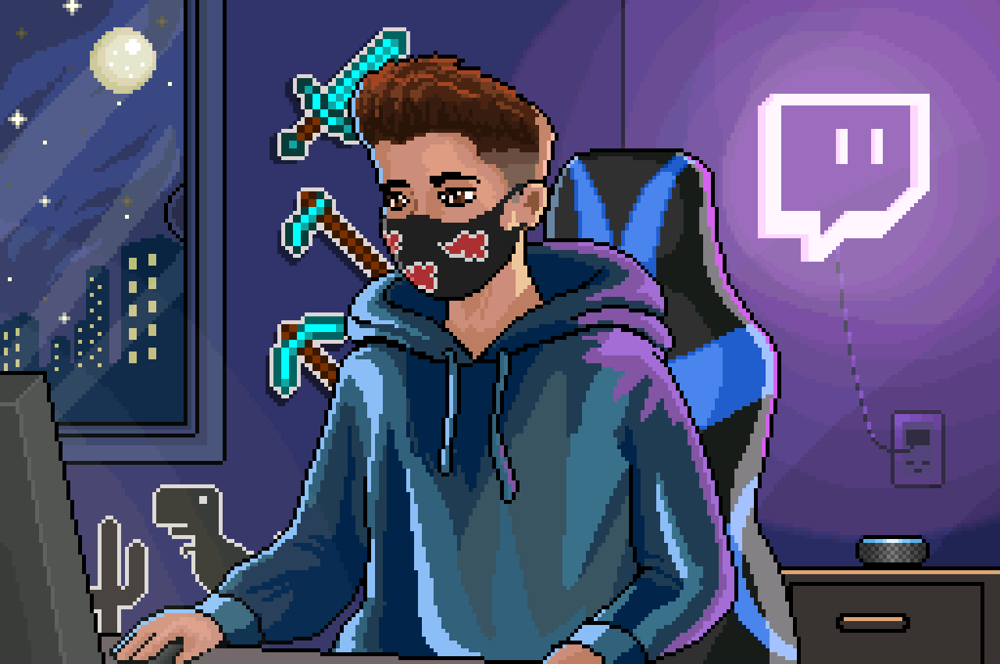

## 👋 Olá, me chamo **Gadriel Herique** 

Sou um profissional dedicado com uma paixão inabalável pela programação. :heart:

Estou constantemente buscando me aperfeiçoar e evoluir como sempre em busca de novos desafios e oportunidades.

Embora admita ser um pouco ansioso e estressado, nada supera o amor e a paixão que tenho pelo meu trabalho diário e acredito que isso é parte do processo de crescimento e evolução em minha carreira, com 3 anos de experiência no campo, atualmente meu foco sendo **Typescript/NodeJS** como **Desenvolvedor Backend**.

## :man_technologist: **Linguagens e frameworks**

 

## 💼 **Ferramentas**

 

## 🎲 **Banco de Dados**

 

"*Não desista, por mais difícil que seja, no final vale a pena. Você escolheu uma jornada desafiadora, mas extremamente recompensadora. Aprender a codificar pode ser intimidador, mas é uma habilidade valiosa que pode ser aplicada a muitas áreas da vida e lhe permitir realizar coisas incríveis. Lembre-se de sempre manter a persistência e a paixão pelo que você está fazendo. Esteja aberto a novas ideias e ao aprendizado constante. Com o tempo, você se tornará mais confiante e habilidoso, e verá todo o seu esforço ser recompensado. Desejo boa sorte!*" :heart:
